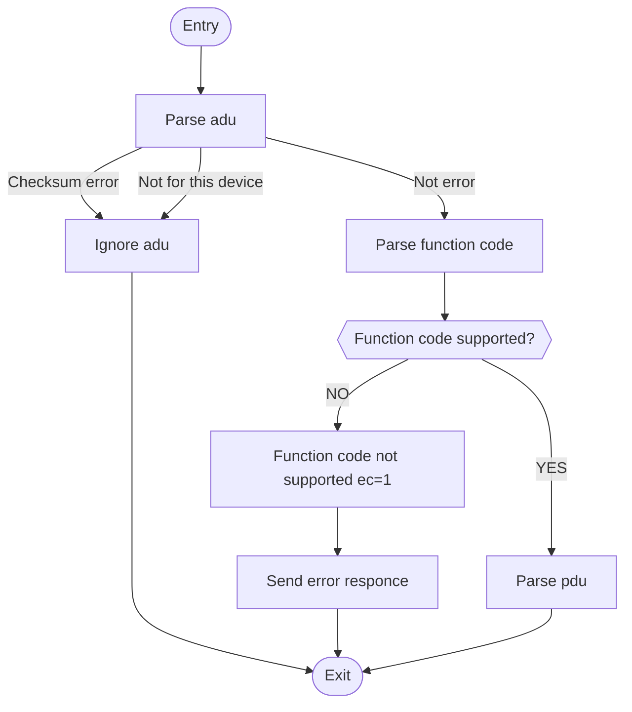

# MODBUS

Modbus protocol encode and decode library for mcu.

## Features

- high reliability.
- zero memory allocation.
- straight forward.
- high performance.
- high compatibility.

## Server working flow

